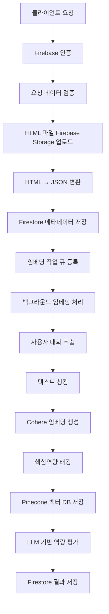

# 페르소나 입력 API 엔드포인트 상세 플로우

## 개요
`POST /api/personas/inputs/` 엔드포인트는 사용자의 페르소나 정보와 HTML 파일을 받아서 전체 RAG 파이프라인을 통해 처리하는 복합적인 시스템입니다.

## 전체 아키텍처 플로우



## 1. API 엔드포인트 진입 및 인증

### 1.1 요청 처리
- **엔드포인트**: `POST /api/personas/inputs/`
- **인증**: Firebase ID 토큰 (`Authorization: Bearer <token>`)
- **파서**: `MultiPartParser` (대용량 파일 지원)
- **최대 파일 크기**: 200MB

### 1.2 데이터 검증
```python
# PersonaInputSerializer를 통한 검증
serializer = PersonaInputSerializer(data=request.data)
serializer.is_valid(raise_exception=True)
```

**검증 필드**:
- `job_category` (필수): 직군 카테고리
- `job_role` (선택): 직무 역할
- `school_name` (선택): 학교명
- `major` (선택): 전공
- `skills` (선택): 보유 기술 배열
- `certifications` (선택): 자격증 배열
- `html_file` (필수): HTML 파일 (MIME: `text/html`)

## 2. Firebase Storage HTML 파일 업로드

### 2.1 파일 업로드 과정
```python
upload_result = upload_persona_html(
    user_id=user_id,
    document_id=document_id,
    file_obj=html_file_copy,
)
```

**저장 경로**: `users/{user_id}/html/{document_id}.html`

### 2.2 업로드 결과
```json
{
    "path": "users/user123/html/doc456.html",
    "size": 1024000,
    "content_type": "text/html"
}
```

## 3. HTML → JSON 변환 처리

### 3.1 HTML 파일 읽기
```python
# 대용량 파일 처리를 위한 스트리밍 읽기
if hasattr(html_file_for_reading, 'temporary_file_path'):
    with open(html_file_for_reading.temporary_file_path(), 'r', encoding='utf-8') as f:
        html_content = f.read()
else:
    html_content = html_file_for_reading.read().decode('utf-8')
```

### 3.2 ChatGPT 변환기 실행
```python
processing_result = process_persona_html_to_json(
    user_id=user_id,
    document_id=document_id,
    html_content=html_content,
    html_file_path=upload_result["path"],
)
```

**변환 과정**:
1. HTML 파싱 및 ChatGPT 대화 구조 추출
2. 사용자-어시스턴트 대화 쌍 매핑
3. JSON 형식으로 구조화
4. Firebase Storage에 JSON 파일 저장
5. 원본 HTML 파일 삭제

### 3.3 JSON 파일 저장
**저장 경로**: `users/{user_id}/json/{document_id}.json`

**JSON 구조**:
```json
{
    "conversations": [
        {
            "id": "conv_001",
            "title": "대화 제목",
            "messages": [
                {
                    "role": "user",
                    "content": "사용자 발화",
                    "timestamp": "2024-01-01T00:00:00Z"
                },
                {
                    "role": "assistant", 
                    "content": "어시스턴트 응답",
                    "timestamp": "2024-01-01T00:00:01Z"
                }
            ]
        }
    ]
}
```

## 4. Firestore 메타데이터 저장

### 4.1 페이로드 구성
```python
payload = serializer.to_firestore_payload(
    html_file_path=upload_result["path"],
    html_content_type=upload_result["content_type"],
    html_file_size=upload_result["size"],
)

# JSON 파일 정보 추가
payload.update({
    "json_file_path": processing_result["json_file_path"],
    "json_content_type": processing_result["json_content_type"],
    "json_file_size": processing_result["json_file_size"],
    "conversations_count": processing_result["conversations_count"],
    "html_file_deleted": processing_result["html_file_deleted"],
})

# 임베딩 상태 초기화
payload.update({
    "embedding_status": "queued",
    "embedding_message": "임베딩 작업이 대기열에 등록되었습니다.",
    "embedding_error": None,
    "embeddings_count": 0,
    "has_embeddings": False,
    "embedding_started_at": None,
    "embedding_completed_at": None,
})
```

### 4.2 Firestore 저장
**저장 경로**: `users/{user_id}/personas/{persona_id}`

**문서 구조**:
```json
{
    "id": "persona_123",
    "user_id": "user_456",
    "job_category": "프론트엔드",
    "job_role": "시니어 프론트엔드 엔지니어",
    "school_name": "서울대학교",
    "major": "컴퓨터공학과",
    "skills": ["React", "TypeScript", "Firebase"],
    "certifications": ["정보처리기사", "AWS Certified Developer"],
    "html_file_path": "users/user_456/html/persona_123.html",
    "json_file_path": "users/user_456/json/persona_123.json",
    "conversations_count": 15,
    "embedding_status": "queued",
    "created_at": "2024-01-01T00:00:00Z",
    "updated_at": "2024-01-01T00:00:00Z"
}
```

## 5. 백그라운드 임베딩 작업 큐 등록

### 5.1 작업 큐 등록
```python
enqueue_embedding_job(
    user_id=user_id,
    persona_id=document_id,
    competency_definitions=core_competencies,
)
```

### 5.2 백그라운드 스레드 실행
```python
thread = Thread(
    target=_run_embedding_job,
    args=(user_id, persona_id, competency_definitions or []),
    daemon=True,
)
thread.start()
```

## 6. 임베딩 파이프라인 처리

### 6.1 상태 업데이트
```python
update_persona_document(
    user_id=user_id,
    persona_id=persona_id,
    payload={
        "embedding_status": "running",
        "embedding_started_at": start_timestamp,
        "embedding_error": None,
        "updated_at": firestore.SERVER_TIMESTAMP,
    },
)
```

### 6.2 JSON 파일 다운로드
```python
download_result = download_persona_json(
    user_id=user_id,
    document_id=persona_id,
)
```

### 6.3 사용자 대화 추출
```python
conversations = await embedding_service.extract_user_conversations(json_content)
```

**추출 과정**:
1. JSON 파싱 및 구조 분석
2. 사용자 발화만 필터링 (`role: "user"`)
3. 대화 ID, 내용, 타임스탬프 추출
4. 빈 내용 필터링

## 7. 텍스트 청킹 및 임베딩 생성

### 7.1 텍스트 청킹
```python
# 토큰 기반 청킹 (최대 400 토큰)
token_ids = TOKENIZER.encode(content)
total_chunks = max(1, (len(token_ids) + MAX_TOKENS_PER_CHUNK - 1) // MAX_TOKENS_PER_CHUNK)

if len(token_ids) <= MAX_TOKENS_PER_CHUNK:
    # 단일 청크
    chunked_items.append({
        "conversation": conv,
        "chunk_index": 0,
        "text": content,
        "title": title,
        "total_chunks": total_chunks,
    })
else:
    # 다중 청크로 분할
    start = 0
    chunk_index = 0
    while start < len(token_ids):
        end = start + MAX_TOKENS_PER_CHUNK
        chunk_token_ids = token_ids[start:end]
        chunk_text = TOKENIZER.decode(chunk_token_ids)
        # 청크 정보 저장
        start = end
        chunk_index += 1
```

### 7.2 Cohere 임베딩 생성
```python
embeddings = await self.cohere_service.embed_texts(
    texts,
    model="embed-multilingual-v3.0",
    input_type="search_document",
)
```

**임베딩 모델**: `embed-multilingual-v3.0`
**벡터 차원**: 1024차원
**입력 타입**: `search_document`

### 7.3 임베딩 데이터 구조화
```python
embedding_data.append({
    "conversation_id": conversation_id,
    "content": text,
    "embedding": embedding,
    "competency_tags": [],
    "created_at": conv.get("timestamp"),
    "role": conv["role"],
    "parent_conversation_id": conv["conversation_id"],
    "chunk_index": chunk_index,
    "original_content": conv["content"],
    "conversation_title": title,
    "next_chunk_id": next_chunk_id,
    "previous_chunk_id": prev_chunk_id,
})
```

## 8. 핵심역량 태깅

### 8.1 역량 정의 임베딩
```python
competency_embeddings = await self.gemini_service.generate_embeddings_batch(competency_payloads)
competency_vectors = [np.asarray(vec, dtype=float) for vec in competency_embeddings]
```

### 8.2 유사도 계산 및 태깅
```python
for item in embedding_data:
    raw_embedding = np.asarray(item.get("embedding", []), dtype=float)
    normalized_embedding = raw_embedding / np.linalg.norm(raw_embedding)
    
    scores = []
    for comp_id, comp_vector in zip(competency_ids, normalized_competency_vectors):
        similarity = float(np.clip(np.dot(normalized_embedding, comp_vector), -1.0, 1.0))
        scores.append((comp_id, similarity))
    
    # 상위 3개 역량 태그 선택 (임계값: 0.25)
    selected_tags = [
        comp_id for comp_id, score in scores
        if score >= similarity_threshold
    ][:max_tags]
    
    item["competency_tags"] = selected_tags
```

## 9. Pinecone 벡터 DB 저장

### 9.1 벡터 포맷팅
```python
def _format_pinecone_vectors(self, embeddings: List[Dict[str, Any]]) -> List[dict]:
    vectors = []
    for item in embeddings:
        metadata = {
            "content": item["content"],
            "role": item.get("role"),
            "created_at": str(item.get("created_at")),
            "parent_conversation_id": item.get("parent_conversation_id"),
            "chunk_index": item.get("chunk_index"),
            "conversation_title": item.get("conversation_title"),
            "next_chunk_id": item.get("next_chunk_id"),
            "previous_chunk_id": item.get("previous_chunk_id"),
            "competency_tags": item.get("competency_tags", []),
            "question": item.get("question"),
        }
        metadata = {k: v for k, v in metadata.items() if v is not None}
        vectors.append({
            "id": item["conversation_id"],
            "values": item["embedding"],
            "metadata": metadata,
        })
    return vectors
```

### 9.2 Pinecone 업서트
```python
formatted = self._format_pinecone_vectors(embeddings)
namespace = user_id  # 사용자별 네임스페이스
self.pinecone_service.upsert_vectors(formatted, namespace=namespace)
```

**Pinecone 설정**:
- **인덱스명**: `job-cheat-vectors`
- **차원**: 1024
- **메트릭**: cosine
- **네임스페이스**: `{user_id}` (사용자별 격리)

## 10. LLM 기반 역량 평가

### 10.1 RAG 검색
```python
# 벡터 검색으로 관련 컨텍스트 조회
search_results = await self.pinecone_service.query_similar(
    vector=competency_embedding,
    namespace=user_id,
    top_k=5,
    include_metadata=True,
    filter={"competency_tags": {"$in": [competency_id]}}
)
```

### 10.2 LLM 프롬프트 구성
```python
SYSTEM_PROMPT = """
당신은 Job-Cheat 플랫폼의 인사 평가 LLM 에이전트입니다.

역할과 규칙은 다음과 같습니다.
- 역할: 한국어 채용 시장을 이해하는 HR 전문가로서, 특정 직군의 핵심역량을 정량·정성 평가합니다.
- 임무: 시스템이 제공한 직군별 핵심역량 정의, 벡터 검색 컨텍스트, 사용자 대화를 모두 고려하여 근거 기반의 평가를 제공합니다.
- 출력: 지정된 JSON 스키마를 100% 준수하며, 불확실성이 있으면 `confidence` 값을 낮게 설정하고 근거 부족을 명시합니다.
- 제한: 외부 지식이나 추측을 사용하지 않고, 제공된 데이터만으로 판단합니다. JSON 외의 자연어 서술은 금지됩니다.
"""

COMPETENCY_EVALUATION_PROMPT = """
당신은 전문 인사담당자입니다. 주어진 데이터와 대화 기록을 바탕으로 특정 핵심역량을 평가해주세요.

## 평가 대상 역량
- 역량 ID: {competency_id}
- 역량명: {competency_name}
- 설명: {competency_description}

## 사용자 기본 정보
- 직군: {job_category}
- 직무: {job_role}
- 보유 기술: {skills}
- 자격증: {certifications}

## 참조해야 할 벡터 검색 컨텍스트 (관련성 높은 순)
{vector_contexts}

## 사용자 대화 기록 (최대 {conversation_limit}건)
{relevant_conversations}

## 평가 기준 (10점 만점)
- 9-10점: 해당 역량에서 전문가 수준의 능력을 보여줌
- 7-8점: 해당 역량에서 숙련된 수준의 능력을 보여줌
- 5-6점: 해당 역량에서 기본적인 수준의 능력을 보여줌
- 3-4점: 해당 역량에서 미숙한 수준의 능력을 보여줌
- 1-2점: 해당 역량에서 초보 수준의 능력을 보여줌

## 응답 형식 (JSON)
{
  "score": 정수점수(1-10),
  "confidence": "매우높음|높음|보통|낮음|매우낮음 중 하나",
  "reasoning": "점수 근거 설명",
  "strong_signals": ["긍정 신호 1", "긍정 신호 2"],
  "risk_factors": ["주의 신호 1", "주의 신호 2"],
  "recommended_actions": ["추천 개선 행동 1", "추천 개선 행동 2"],
  "evidence": [
    {
      "source": "vector_context" 또는 "conversation",
      "reference_id": "컨텍스트 또는 대화 ID",
      "snippet": "관련 문장",
      "relevance_score": 0.0에서 1.0 사이 수치
    }
  ]
}
"""
```

### 10.3 Gemini API 호출
```python
evaluation_result = await self.gemini_service.generate_structured_response(
    system_prompt=SYSTEM_PROMPT,
    user_prompt=formatted_prompt,
    response_schema=COMPETENCY_EVALUATION_SCHEMA,
    model="gemini-1.5-pro"
)
```

### 10.4 평가 결과 파싱
```python
try:
    evaluation_data = json.loads(evaluation_result)
    score = evaluation_data.get("score", 0)
    confidence = evaluation_data.get("confidence", "낮음")
    reasoning = evaluation_data.get("reasoning", "")
    strong_signals = evaluation_data.get("strong_signals", [])
    risk_factors = evaluation_data.get("risk_factors", [])
    recommended_actions = evaluation_data.get("recommended_actions", [])
    evidence = evaluation_data.get("evidence", [])
except json.JSONDecodeError as exc:
    logger.error(f"LLM 응답 JSON 파싱 실패: {exc}")
    # 기본값으로 처리
```

## 11. Firestore 최종 결과 저장

### 11.1 임베딩 완료 상태 업데이트
```python
update_persona_document(
    user_id=user_id,
    persona_id=persona_id,
    payload={
        "embedding_status": "completed",
        "embedding_message": "대화기록 처리 및 임베딩 저장이 완료되었습니다.",
        "embeddings_count": result.get("embeddings_count", 0),
        "embedding_model": "embed-multilingual-v3.0",
        "has_embeddings": True,
        "vectorized_competency_tags": unique_tags,
        "embedding_error": None,
        "embedding_completed_at": firestore.SERVER_TIMESTAMP,
        "updated_at": firestore.SERVER_TIMESTAMP,
    },
)
```

### 11.2 역량 평가 결과 저장
```python
mark_competency_evaluation(
    user_id=user_id,
    persona_id=persona_id,
    competency_scores={
        competency_id: {
            "score": score,
            "confidence": confidence,
            "reasoning": reasoning,
            "strong_signals": strong_signals,
            "risk_factors": risk_factors,
            "recommended_actions": recommended_actions,
            "evidence": evidence,
            "evaluation_date": firestore.SERVER_TIMESTAMP,
        }
    },
    evaluation_version=COMPETENCY_EVALUATION_VERSION,
)
```

## 12. 에러 처리 및 복구

### 12.1 임베딩 실패 처리
```python
def _mark_embedding_failed(user_id: str, persona_id: str, reason: str) -> None:
    try:
        update_persona_document(
            user_id=user_id,
            persona_id=persona_id,
            payload={
                "embedding_status": "failed",
                "embedding_error": reason,
                "embedding_completed_at": firestore.SERVER_TIMESTAMP,
                "updated_at": firestore.SERVER_TIMESTAMP,
            },
        )
    except Exception:
        logger.exception("임베딩 실패 상태 기록에 실패했습니다: %s", reason)
```

### 12.2 주요 에러 케이스
- **JSON 다운로드 실패**: `json_download_failed`
- **JSON 내용 없음**: `json_content_missing`
- **임베딩 생성 실패**: `embedding_failed`
- **Pinecone 저장 실패**: `pinecone_upsert_failed`
- **LLM 평가 실패**: `llm_evaluation_failed`

## 13. 성능 및 모니터링

### 13.1 처리 시간 추적
- **HTML 업로드**: ~1-5초 (파일 크기에 따라)
- **JSON 변환**: ~2-10초 (대화 수에 따라)
- **임베딩 생성**: ~10-60초 (텍스트 양에 따라)
- **Pinecone 저장**: ~1-3초
- **LLM 평가**: ~5-15초 (역량 수에 따라)

### 13.2 리소스 사용량
- **메모리**: 대화당 ~1-5MB
- **API 호출**: Cohere 임베딩 + Gemini 평가
- **벡터 저장**: Pinecone 네임스페이스당 ~100MB-1GB

### 13.3 로깅 및 모니터링
```python
logger.info(f"페르소나 입력 처리 시작: user_id={user_id}, document_id={document_id}")
logger.info(f"HTML 파일 업로드 완료: 경로={upload_result['path']}")
logger.info(f"HTML 처리 완료: JSON 파일={processing_result['json_file_path']}")
logger.info(f"임베딩 생성 완료 - 총 {len(embedding_data)}개")
logger.info(f"사용자 대화기록 처리 완료 - 사용자 ID: {user_id}")
```

## 14. 보안 및 데이터 보호

### 14.1 사용자 데이터 격리
- **Firebase Storage**: 사용자별 경로 분리
- **Pinecone**: 사용자별 네임스페이스 분리
- **Firestore**: 사용자별 컬렉션 분리

### 14.2 데이터 암호화
- **전송 중**: HTTPS/TLS 암호화
- **저장 시**: Firebase 기본 암호화
- **벡터 DB**: Pinecone 암호화

### 14.3 접근 제어
- **Firebase 인증**: ID 토큰 검증
- **사용자 권한**: 본인 데이터만 접근 가능
- **API 제한**: 파일 크기 및 요청 빈도 제한

## 15. 확장성 고려사항

### 15.1 대용량 파일 처리
- **스트리밍 업로드**: 메모리 효율적 처리
- **청킹**: 토큰 기반 텍스트 분할
- **백그라운드 처리**: 비동기 임베딩 작업

### 15.2 확장 가능한 아키텍처
- **마이크로서비스**: 각 컴포넌트 독립적 확장
- **큐 시스템**: 작업 부하 분산
- **캐싱**: 임베딩 결과 캐싱

### 15.3 모니터링 및 알림
- **성능 메트릭**: 처리 시간, 성공률 추적
- **에러 알림**: 실패 시 관리자 알림
- **사용량 추적**: API 호출 및 리소스 사용량

이 문서는 `/api/personas/inputs/` 엔드포인트의 전체 플로우를 상세하게 설명하며, 각 단계별 처리 과정, 데이터 구조, 에러 처리, 성능 고려사항을 포함합니다.
