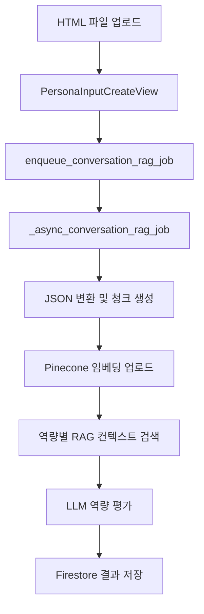

# 역량 평가 기능 구현 문서

## 📋 개요

이 문서는 `/api/personas/inputs/` 엔드포인트에 통합된 자동 역량 평가 기능의 구현 내용을 설명합니다. 사용자가 HTML 파일을 업로드하면 자동으로 RAG 기반 역량 평가가 수행되고, 결과가 Firestore에 저장됩니다.

## 🏗️ 아키텍처

### 전체 플로우


### 핵심 컴포넌트
- **PersonaInputCreateView**: HTML 업로드 엔드포인트
- **conversation_rag_embedding_job.py**: 백그라운드 역량 평가 로직
- **ConversationRAGService**: RAG 컨텍스트 검색
- **GeminiService**: LLM 역량 평가
- **Firestore**: 결과 저장

## 🔧 구현 세부사항

### 1. 엔드포인트 통합

#### PersonaInputCreateView 수정
**파일**: `job_cheat/personas/views.py`

```python
# 역량 정의를 역량 평가 형식으로 변환
competency_definitions = _convert_competencies_for_evaluation(core_competencies)

enqueue_conversation_rag_job(
    user_id=user_id,
    persona_id=document_id,
    competency_definitions=competency_definitions,
)
```

#### 역량 정의 변환 함수
```python
def _convert_competencies_for_evaluation(core_competencies: List[Dict[str, str]]) -> List[Dict[str, str]]:
    """핵심 역량을 역량 평가 형식으로 변환합니다."""
    
    competency_query_mapping = {
        "문제정의": "문제 정의 및 분석 능력",
        "데이터분석": "데이터 분석 및 해석 능력", 
        "사용자경험": "사용자 경험 설계 및 개선 능력",
        # ... 기타 역량 매핑
    }
    
    converted_competencies = []
    for competency in core_competencies:
        converted_competency = {
            'name': competency.get('name', ''),
            'description': competency.get('description', ''),
            'query': competency_query_mapping.get(competency_name, f"{competency_name} 역량")
        }
        converted_competencies.append(converted_competency)
    
    return converted_competencies
```

### 2. 백그라운드 역량 평가 로직

#### 메인 실행 함수
**파일**: `job_cheat/core/services/conversation_rag_embedding_job.py`

```python
async def _async_conversation_rag_job(
    user_id: str,
    persona_id: str,
    competency_definitions: List[Dict[str, Any]]
) -> None:
    """실제 대화 RAG 임베딩 파이프라인을 실행하고 Firestore 문서를 갱신한다."""
    
    # 1단계: JSON 파일에서 청크 생성
    chunks = conversation_rag_service.process_conversation_json(user_id, persona_id)
    
    # 2단계: Pinecone에 임베딩 업로드
    await conversation_rag_service.embed_and_upsert_to_pinecone(chunks, user_id)
    
    # 3단계: 역량 평가 수행
    if competency_definitions:
        competency_evaluation_results = {}
        
        for competency in competency_definitions:
            # RAG 컨텍스트 검색
            context = await conversation_rag_service.get_rag_context(
                query=competency['query'],
                user_id=user_id,
                top_k=3
            )
            
            if context:
                # LLM 역량 평가 수행
                evaluation_result = await _evaluate_competency_with_citations(
                    competency_name=competency['name'],
                    competency_description=competency['description'],
                    context=context,
                    gemini_service=gemini_service
                )
                
                if evaluation_result:
                    competency_evaluation_results[competency['name']] = evaluation_result
        
        # 역량 평가 결과를 Firestore에 저장
        if competency_evaluation_results:
            await _save_competency_evaluations_to_firestore(
                user_id=user_id,
                persona_id=persona_id,
                evaluation_results=competency_evaluation_results
            )
```

### 3. LLM 역량 평가 함수

#### 인용문 기반 평가
```python
async def _evaluate_competency_with_citations(
    competency_name: str,
    competency_description: str,
    context: str,
    gemini_service: GeminiService
) -> Optional[Dict[str, Any]]:
    """실제 대화 내용을 인용하여 역량을 평가합니다."""
    
    evaluation_prompt = f"""
다음은 한 사용자의 ChatGPT 대화 기록에서 추출한 관련 컨텍스트입니다.

=== 대화 컨텍스트 ===
{context}

=== 평가 요청 ===
{competency_name}: {competency_description}

=== 평가 지침 ===
1. 위 대화 컨텍스트를 바탕으로 사용자의 {competency_name} 역량을 구체적으로 평가해주세요.
2. **반드시 대화 내용에서 실제 인용문을 포함하여 근거를 제시해주세요.**
3. 인용할 때는 "사용자: [인용문]" 또는 "어시스턴트: [인용문]" 형식으로 명확히 표시해주세요.
4. 강점과 개선점을 균형있게 분석해주세요.
5. 평가 점수(1-10점)와 함께 구체적인 이유를 설명해주세요.

=== 응답 형식 (JSON) ===
{{
    "competency_name": "{competency_name}",
    "score": 8,
    "score_explanation": "점수에 대한 구체적인 설명",
    "strengths": [
        {{
            "description": "강점 설명",
            "evidence": "대화에서 인용한 구체적 근거",
            "citation": "사용자: [실제 인용문]"
        }}
    ],
    "improvements": [
        {{
            "description": "개선점 설명",
            "suggestion": "구체적인 개선 방안",
            "evidence": "대화에서 인용한 구체적 근거",
            "citation": "사용자: [실제 인용문]"
        }}
    ],
    "overall_assessment": "전체적인 평가 및 종합 의견",
    "key_insights": [
        "핵심 인사이트 1",
        "핵심 인사이트 2"
    ]
}}
"""
    
    # Gemini를 사용한 구조화된 평가 수행
    evaluation_result = await gemini_service.generate_structured_response(
        prompt=evaluation_prompt,
        response_format="json"
    )
    
    if evaluation_result:
        evaluation_data = json.loads(evaluation_result.strip())
        return evaluation_data
    
    return None
```

### 4. Firestore 저장 함수

#### 결과 저장 로직
```python
async def _save_competency_evaluations_to_firestore(
    user_id: str,
    persona_id: str,
    evaluation_results: Dict[str, Any]
) -> bool:
    """역량 평가 결과를 Firestore에 저장합니다."""
    
    # Firestore 문서 업데이트 데이터 구성
    update_payload = {}
    
    for competency_name, evaluation_data in evaluation_results.items():
        update_payload[f"competencies.{competency_name}"] = {
            "score": evaluation_data.get("score", 0),
            "score_explanation": evaluation_data.get("score_explanation", ""),
            "strengths": evaluation_data.get("strengths", []),
            "improvements": evaluation_data.get("improvements", []),
            "overall_assessment": evaluation_data.get("overall_assessment", ""),
            "key_insights": evaluation_data.get("key_insights", []),
            "evaluated_at": firestore.SERVER_TIMESTAMP
        }
    
    # Firestore 문서 업데이트
    result = update_persona_document(
        user_id=user_id,
        persona_id=persona_id,
        payload=update_payload
    )
    
    return result
```

## 📊 데이터 구조

### Firestore 저장 형식

```json
{
  "competencies": {
    "문제정의": {
      "score": 8,
      "score_explanation": "사용자는 복잡한 문제를 체계적으로 분석하고 핵심 이슈를 파악하는 능력이 뛰어납니다.",
      "strengths": [
        {
          "description": "문제를 다각도로 분석하는 능력",
          "evidence": "사용자가 기술적, 비즈니스적, 사용자 관점에서 문제를 분석했습니다.",
          "citation": "사용자: '기술적으로는 성능 문제가 있고, 비즈니스적으로는 사용자 이탈이 우려되며, UX 관점에서는 인터페이스가 복잡합니다.'"
        }
      ],
      "improvements": [
        {
          "description": "데이터 기반 의사결정 강화",
          "suggestion": "정량적 지표를 활용한 문제 우선순위 설정",
          "evidence": "주관적 판단에 의존하는 경향이 있습니다.",
          "citation": "사용자: '느낌상 이 문제가 가장 중요할 것 같습니다.'"
        }
      ],
      "overall_assessment": "전반적으로 문제 정의 능력이 우수하나, 데이터 기반 접근을 강화하면 더욱 효과적일 것입니다.",
      "key_insights": [
        "체계적인 문제 분석 능력",
        "다양한 관점에서의 접근"
      ],
      "evaluated_at": "2025-01-27T16:00:00.000Z"
    }
  }
}
```

## 🚀 사용 방법

### 1. HTML 파일 업로드

```bash
curl -X POST http://localhost:8000/api/personas/inputs/ \
  -H "Authorization: Bearer YOUR_FIREBASE_TOKEN" \
  -F "job_category=기획" \
  -F "html_file=@chatgpt_export/chat.html"
```

### 2. 자동 역량 평가

- HTML 업로드 후 자동으로 백그라운드에서 실행
- 직군별 핵심 역량에 대한 평가 수행
- 결과는 Firestore에 자동 저장

### 3. 결과 확인

```python
# Firestore에서 결과 조회
from core.services.firebase_personas import get_persona_document

result = get_persona_document(user_id="user123", persona_id="persona456")
competencies = result.get("competencies", {})
```

## 🔍 핵심 특징

### 1. **자동화된 플로우**
- HTML 업로드 후 자동으로 역량 평가 수행
- 사용자 개입 없이 백그라운드에서 실행

### 2. **RAG 기반 평가**
- 사용자 대화 내용을 기반으로 한 컨텍스트 검색
- 관련성 높은 대화 내용만 선별하여 평가

### 3. **인용문 기반 근거**
- 실제 대화 내용을 인용하여 평가 근거 제시
- "사용자: [인용문]" 형식으로 명확한 출처 표시

### 4. **구조화된 JSON 응답**
- 점수, 강점, 개선점, 핵심 인사이트 등 체계적 분류
- Firestore에 구조화된 형태로 저장

### 5. **직군별 맞춤 평가**
- 선택한 직군의 핵심 역량에 대한 평가
- 역량별 맞춤형 쿼리로 정확도 향상

## 📈 성능 최적화

### 1. **비동기 처리**
- 백그라운드 스레드에서 실행
- 사용자 경험에 영향 없음

### 2. **배치 처리**
- Pinecone 업로드는 100개씩 배치 처리
- 메모리 효율성 향상

### 3. **에러 처리**
- 각 단계별 예외 처리
- 실패 시 Firestore에 상태 기록

## 🧪 테스트

### 테스트 스크립트
- **`test_llm_with_existing_pinecone.py`**: 기존 Pinecone 데이터를 활용한 테스트
- **`debug_pinecone_search.py`**: Pinecone 검색 디버깅

### 테스트 실행
```bash
# 기존 데이터를 활용한 테스트
uv run python job_cheat/scripts/test_llm_with_existing_pinecone.py

# Pinecone 디버깅
uv run python job_cheat/scripts/debug_pinecone_search.py
```

## 🔧 환경 설정

### 필수 환경 변수
```env
GEMINI_API_KEY=your_gemini_api_key
COHERE_API_KEY=your_cohere_api_key
PINECONE_API_KEY=your_pinecone_api_key
FIREBASE_PROJECT_ID=your_firebase_project_id
```

### 의존성
```toml
dependencies = [
    "google-generativeai>=0.3.0",
    "cohere>=5.18.0",
    "pinecone-client>=3.0.0",
    "firebase-admin>=6.0.0"
]
```

## 📝 로그 및 모니터링

### 로그 레벨
- **INFO**: 일반적인 진행 상황
- **WARNING**: 주의가 필요한 상황
- **ERROR**: 오류 발생 시

### 주요 로그 메시지
```
역량 평가 시작: 4개 역량
RAG 컨텍스트 조회 성공: 1,234자
✅ 문제정의 역량 평가 완료: 8/10
✅ 역량 평가 결과 Firestore 저장 완료: 4개
```

## 🚨 에러 처리

### 일반적인 에러 상황
1. **JSON 파싱 실패**: LLM 응답이 올바른 JSON 형식이 아닌 경우
2. **RAG 컨텍스트 없음**: 관련 대화 내용을 찾을 수 없는 경우
3. **Firestore 저장 실패**: 네트워크 또는 권한 문제

### 에러 복구
- 각 단계별 try-catch 처리
- 실패 시 Firestore에 상태 기록
- 사용자에게 적절한 에러 메시지 제공

## 🔮 향후 개선 사항

### 1. **평가 품질 향상**
- 더 정교한 프롬프트 엔지니어링
- 평가 기준 세분화

### 2. **성능 최적화**
- 캐싱 메커니즘 도입
- 병렬 처리 강화

### 3. **사용자 경험 개선**
- 실시간 진행 상황 표시
- 결과 시각화

## 📚 참고 자료

- [personas-fix-merge-analysis.md](../personas-fix-merge-analysis.md): 대화 RAG 시스템 분석
- [persona-input-detailed-flow.md](../persona-input-detailed-flow.md): 페르소나 입력 상세 플로우
- [conversation-rag-integration.md](../conversation-rag-integration.md): 대화 RAG 통합 가이드
