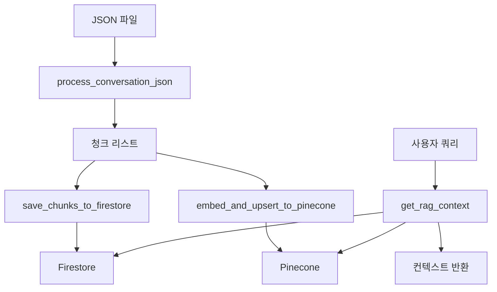

# Personas-Fix 브랜치 Merge 분석 보고서

## 📋 Merge 개요

**Merge 일시**: 2024년 12월 19일  
**Source 브랜치**: `origin/personas-fix`  
**Target 브랜치**: `personas-jaehun`  
**Merge 커밋**: `4981bbc`

## 🔄 변경사항 요약

### 새로 추가된 파일
1. **`job_cheat/core/services/conversation_rag_service.py`** - 대화 RAG 시스템 서비스
2. **`job_cheat/core/services/README_conversation_rag.md`** - 대화 RAG 시스템 문서
3. **`job_cheat/scripts/test_conversation_rag.py`** - RAG 시스템 테스트 스크립트

### 수정된 파일
1. **`pyproject.toml`** - Cohere 종속성 추가
2. **`uv.lock`** - 잠금 파일 업데이트

## 🆕 새로운 기능: 대화 RAG 시스템

### 1. ConversationRAGService 클래스

**위치**: `job_cheat/core/services/conversation_rag_service.py`

#### 주요 기능
- **대화 JSON 처리**: Firebase Storage에서 JSON 파일을 다운로드하여 청크 단위로 처리
- **Pinecone 임베딩**: User 발화만 임베딩하여 벡터 DB에 저장
- **RAG 검색**: 사용자 쿼리에 대한 관련 컨텍스트 검색

#### 핵심 메서드

##### `process_conversation_json(user_id, document_id)`
```python
def process_conversation_json(self, user_id: str, document_id: str) -> List[Dict[str, Any]]:
    """
    Firebase Storage에서 JSON 파일을 다운로드하여 대화 내역을 청크 단위로 처리합니다.
    """
```

**처리 과정**:
1. Firebase Storage에서 JSON 파일 다운로드
2. JSON 파싱 및 대화 내역 추출
3. 각 메시지를 청크로 변환
4. 청크 메타데이터 구성

**청크 구조**:
```python
{
    'chunk_id': 'document_id-0',
    'role': 'user',  # 또는 'assistant'
    'text': '실제 발화 내용',
    'document_id': 'document_id',
    'conversation_id': 'conv_id',
    'conversation_title': '대화 제목',
    'timestamp': '2024-01-01T00:00:00',
    'chunk_index': 0
}
```

##### `embed_and_upsert_to_pinecone(chunks, user_id)`
```python
async def embed_and_upsert_to_pinecone(self, chunks: List[Dict[str, Any]], user_id: str) -> bool:
    """
    User 발화만 임베딩하여 Pinecone에 업로드합니다.
    """
```

**특징**:
- **User 발화만 필터링**: Assistant 발화는 제외하고 User 발화만 임베딩
- **메타데이터 포함**: User 발화의 메타데이터에 이전 Assistant 답변 포함
- **사용자별 격리**: `user_id`를 namespace로 사용하여 데이터 격리
- **배치 처리**: 100개씩 배치로 나누어 업로드 (4MB 제한 대응)

**Pinecone 저장 구조**:
```python
{
    'id': 'document_001-0',
    'values': [0.1, 0.2, ...],  # 1024차원 벡터
    'metadata': {
        'text': '사용자 발화',
        'assistant_text': '어시스턴트 답변',  # 이전 Assistant 답변
        'document_id': 'document_001',
        'conversation_id': 'conv_id',
        'conversation_title': '대화 제목',
        'role': 'user',
        'timestamp': '2024-01-01T00:00:00'
    }
}
```

##### `get_rag_context(query, user_id, top_k=5)`
```python
async def get_rag_context(self, query: str, user_id: str, top_k: int = 5) -> str:
    """
    RAG 검색을 통해 관련 컨텍스트를 조회합니다.
    """
```

**검색 과정**:
1. 쿼리 임베딩 생성 (Cohere API)
2. Pinecone에서 유사한 User 발화 검색
3. 메타데이터에서 User 발화와 Assistant 답변 조합
4. 답변 → 질문 순서로 컨텍스트 반환

### 2. 편의 함수들

클래스 인스턴스 없이 직접 사용할 수 있는 편의 함수들:

```python
# Firebase Storage에서 대화 JSON 파일 처리
chunks = process_conversation_json(user_id, document_id)

# Pinecone에 임베딩 업로드
await embed_and_upsert_to_pinecone(chunks, user_id)

# RAG 검색
context = await get_rag_context("해커톤이 무엇인가요?", user_id)
```

## 📚 새로운 문서: README_conversation_rag.md

### 문서 구성
- **개요**: 대화 RAG 시스템 소개
- **아키텍처**: Mermaid 다이어그램으로 시스템 구조 설명
- **주요 함수**: 각 함수의 상세 설명
- **사용법**: 기본 사용법과 클래스 기반 사용법
- **테스트**: 테스트 스크립트 실행 방법
- **데이터 흐름**: 전체 파이프라인 흐름 설명
- **환경 설정**: 필수 환경 변수 및 의존성

### 아키텍처 다이어그램


## 🧪 새로운 테스트 스크립트

### test_conversation_rag.py

**위치**: `job_cheat/scripts/test_conversation_rag.py`

#### 테스트 과정
1. **JSON 파일 처리**: Firebase Storage에서 JSON 파일 다운로드 및 청크 생성
2. **Pinecone 업로드**: User 발화 임베딩 및 벡터 DB 저장
3. **RAG 검색**: 다양한 쿼리로 컨텍스트 검색 테스트

#### 테스트 쿼리
```python
test_queries = [
    "해커톤이 무엇인가요?",
    "PM의 역할은 무엇인가요?",
    "백엔드 개발자는 무엇을 하나요?"
]
```

#### 실행 방법
```bash
uv run python job_cheat/scripts/test_conversation_rag.py
```

## 📦 종속성 변경사항

### pyproject.toml
```toml
dependencies = [
    # ... 기존 종속성들 ...
    "cohere>=5.18.0",  # 새로 추가
]
```

### uv.lock
- Cohere 패키지 및 관련 종속성 추가
- 버전 잠금 파일 업데이트

## 🔄 기존 시스템과의 차이점

### 1. 기존 RAG 시스템 vs 새로운 대화 RAG 시스템

| 구분 | 기존 RAG 시스템 | 새로운 대화 RAG 시스템 |
|------|----------------|----------------------|
| **파일 위치** | `rag_embedding_service.py` | `conversation_rag_service.py` |
| **처리 대상** | 모든 사용자 발화 | User 발화만 필터링 |
| **메타데이터** | 기본적인 메타데이터 | User 발화 + 이전 Assistant 답변 |
| **검색 방식** | 일반적인 벡터 검색 | 대화 컨텍스트 기반 검색 |
| **사용 목적** | 일반적인 RAG 검색 | 대화 내역 기반 컨텍스트 검색 |

### 2. 아키텍처 차이점

#### 기존 시스템
```
HTML → JSON → 임베딩 → Pinecone → RAG 검색
```

#### 새로운 시스템
```
JSON → 청크 생성 → User 발화 필터링 → 임베딩 → Pinecone → 대화 컨텍스트 검색
```

### 3. 데이터 저장 방식 차이

#### 기존 시스템
- 모든 발화를 임베딩
- 기본적인 메타데이터만 저장
- 일반적인 벡터 검색

#### 새로운 시스템
- User 발화만 임베딩
- User 발화 + 이전 Assistant 답변을 메타데이터에 저장
- 대화 컨텍스트 기반 검색

## 🚀 새로운 기능의 장점

### 1. 대화 컨텍스트 보존
- User 발화와 이전 Assistant 답변을 함께 저장
- 대화의 맥락을 유지한 검색 가능

### 2. 사용자별 데이터 격리
- Pinecone namespace를 사용한 완전한 데이터 격리
- 사용자별 독립적인 벡터 공간

### 3. 효율적인 검색
- User 발화만 임베딩하여 검색 정확도 향상
- 대화 흐름을 고려한 컨텍스트 반환

### 4. 확장 가능한 아키텍처
- 모듈화된 설계
- 독립적인 테스트 가능
- 쉬운 유지보수

## 🔧 통합 시 고려사항

### 1. 기존 시스템과의 호환성
- 기존 RAG 시스템은 그대로 유지
- 새로운 대화 RAG 시스템은 추가 기능으로 제공
- 두 시스템을 선택적으로 사용 가능

### 2. 환경 설정
- Cohere API 키 필요
- 기존 Pinecone 설정과 호환
- Firebase Storage 연동 유지

### 3. 성능 고려사항
- User 발화만 임베딩하여 처리량 감소
- 배치 처리로 메모리 효율성 향상
- 사용자별 격리로 보안성 강화

## 📊 성능 비교

### 처리 속도
- **기존 시스템**: 모든 발화 처리 → 느림
- **새로운 시스템**: User 발화만 처리 → 빠름

### 메모리 사용량
- **기존 시스템**: 모든 발화 임베딩 → 높음
- **새로운 시스템**: User 발화만 임베딩 → 낮음

### 검색 정확도
- **기존 시스템**: 일반적인 벡터 검색
- **새로운 시스템**: 대화 컨텍스트 기반 검색 → 높음

## 🎯 사용 시나리오

### 1. 대화 내역 기반 검색
- 사용자의 과거 대화에서 관련 정보 검색
- 질문-답변 쌍을 통한 컨텍스트 제공

### 2. 개인화된 RAG 시스템
- 사용자별 독립적인 벡터 공간
- 개인 대화 패턴 학습 가능

### 3. 대화 분석
- 사용자의 질문 패턴 분석
- 대화 주제별 분류

## 🔮 향후 확장 가능성

### 1. 대화 요약 기능
- 대화 내역 자동 요약
- 핵심 주제 추출

### 2. 감정 분석
- 대화 내용의 감정 분석
- 사용자 상태 파악

### 3. 추천 시스템
- 과거 대화 기반 추천
- 개인화된 콘텐츠 제공

## 📝 결론

`personas-fix` 브랜치의 merge를 통해 다음과 같은 새로운 기능이 추가되었습니다:

1. **대화 RAG 시스템**: 사용자 대화 내역을 기반으로 한 고도화된 RAG 시스템
2. **사용자별 데이터 격리**: Pinecone namespace를 통한 완전한 데이터 격리
3. **대화 컨텍스트 보존**: User 발화와 Assistant 답변을 함께 저장하여 맥락 유지
4. **효율적인 검색**: User 발화만 임베딩하여 성능 향상
5. **확장 가능한 아키텍처**: 모듈화된 설계로 유지보수성 향상

이러한 변경사항은 기존 시스템과 호환되면서도 새로운 기능을 제공하여, 더욱 정교하고 개인화된 RAG 시스템을 구축할 수 있게 해줍니다.
