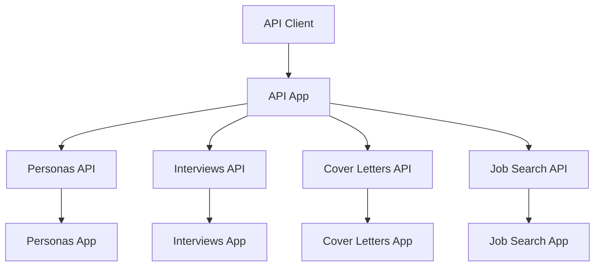

# API App

REST API 엔드포인트를 제공하는 Django 앱입니다.

## 📋 개요

API 앱은 프로젝트의 모든 REST API 엔드포인트를 통합 관리하는 중앙 집중식 API 모듈입니다. 각 도메인 앱의 API를 통합하여 일관된 API 인터페이스를 제공합니다.

## 🏗️ 구조

```
api/
├── migrations/            # 데이터베이스 마이그레이션
├── apps.py               # 앱 설정
├── models.py             # API 관련 모델
├── serializers.py        # DRF 시리얼라이저
├── urls.py              # URL 라우팅
└── views.py             # 뷰 로직
```

## 🚀 주요 기능

### 1. 통합 API 엔드포인트

- 모든 도메인 앱의 API 통합
- 일관된 API 인터페이스 제공
- API 버전 관리

### 2. API 인증 및 권한

- 사용자 인증 처리
- API 권한 관리
- 요청 제한 및 보안

### 3. API 문서화

- 자동 API 문서 생성
- API 사용 예제 제공
- API 스키마 정의

## 🔧 API 엔드포인트

### 페르소나 API

```http
# 페르소나 입력 생성
POST /api/personas/input/create/

# 페르소나 목록 조회
GET /api/personas/list/

# 페르소나 상세 조회
GET /api/personas/{persona_id}/
```

### 면접 API

```http
# 면접 준비 데이터 조회
GET /api/interviews/preparation/

# 면접 질문 생성
POST /api/interviews/generate/

# 다음 질문 조회
GET /api/interviews/next-question/

# 답변 제출
POST /api/interviews/submit-answer/

# 면접 결과 조회
GET /api/interviews/result/{interview_session_id}/
```

### 자기소개서 API

```http
# 자기소개서 목록 조회
GET /api/cover-letters/

# 자기소개서 생성
POST /api/cover-letters/generate/

# 자기소개서 상세 조회
GET /api/cover-letters/{cover_letter_id}/

# 자기소개서 수정
PUT /api/cover-letters/{cover_letter_id}/

# 자기소개서 삭제
DELETE /api/cover-letters/{cover_letter_id}/
```

### 채용공고 API

```http
# 채용공고 추천
GET /api/job-search/recommendations/

# 채용공고 검색
GET /api/job-search/search/

# 채용공고 상세 조회
GET /api/job-search/jobs/{job_id}/

# 채용공고 스크래핑
POST /api/job-search/scrape/
```

## 🛠️ 사용법

### API 클라이언트 사용

```python
import requests

# 페르소나 입력 생성
response = requests.post(
    'http://localhost:8000/api/personas/input/create/',
    files={'html_file': open('conversation.html', 'rb')},
    data={'user_id': 'user123'}
)

# 면접 질문 생성
response = requests.post(
    'http://localhost:8000/api/interviews/generate/',
    json={
        'persona_id': 'persona456',
        'use_voice': True
    }
)

# 채용공고 추천
response = requests.get(
    'http://localhost:8000/api/job-search/recommendations/',
    params={
        'user_id': 'user123',
        'persona_id': 'persona456',
        'limit': 10
    }
)
```

### Django REST Framework 사용

```python
from rest_framework.test import APIClient

# API 클라이언트 생성
client = APIClient()

# 페르소나 입력 생성
with open('conversation.html', 'rb') as f:
    response = client.post(
        '/api/personas/input/create/',
        {'html_file': f, 'user_id': 'user123'},
        format='multipart'
    )

# 면접 질문 생성
response = client.post(
    '/api/interviews/generate/',
    {
        'persona_id': 'persona456',
        'use_voice': True
    },
    format='json'
)
```

## 📊 API 구조



## 🔧 환경 설정

### 필수 환경 변수

```env
# Django
SECRET_KEY=your_secret_key
DEBUG=True

# Firebase
FIREBASE_CREDENTIALS=path/to/firebase-credentials.json

# AI Services
GEMINI_API_KEY=your_gemini_api_key
COHERE_API_KEY=your_cohere_api_key
PINECONE_API_KEY=your_pinecone_api_key
```

## 📚 관련 서비스

- **Personas**: 페르소나 데이터 관리
- **Interviews**: 면접 서비스
- **Cover Letters**: 자기소개서 서비스
- **Job Search**: 채용공고 서비스
- **Core Services**: 공통 인프라 서비스
