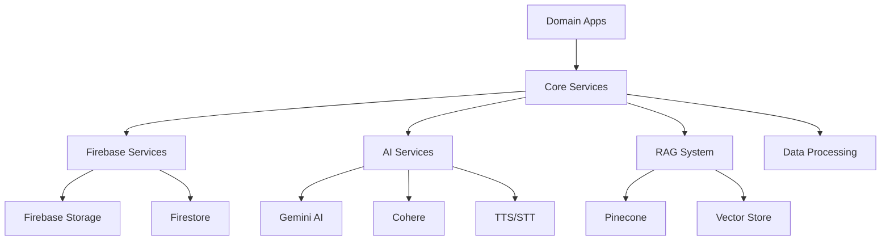

# Core Services

공통 인프라 서비스 및 유틸리티를 제공하는 핵심 모듈입니다.

## 📋 개요

Core 모듈은 프로젝트 전반에서 사용되는 공통 서비스들을 제공합니다. Firebase 연동, AI 서비스, RAG 시스템, 데이터 처리 등의 인프라 서비스를 포함합니다.

## 🏗️ 구조

```
core/
├── services/               # 공통 서비스들
│   ├── firebase_*.py      # Firebase 관련 서비스
│   ├── rag_*.py           # RAG 시스템 서비스
│   ├── *_service.py       # AI 서비스들
│   └── tests/             # 서비스 테스트
├── data/                  # 정적 데이터
├── authentication.py      # 인증 관련
├── serializers.py         # 공통 시리얼라이저
└── utils.py              # 유틸리티 함수들
```

## 🔧 주요 서비스

### Firebase 서비스

- **`firebase_storage.py`**: Firebase Storage 파일 업로드/다운로드
- **`firebase_personas.py`**: 페르소나 데이터 CRUD
- **`firebase_users.py`**: 사용자 데이터 관리

### AI 서비스

- **`gemini_service.py`**: Google Gemini AI 연동
- **`cohere_service.py`**: Cohere 임베딩 서비스
- **`tts_service.py`**: Google Cloud Text-to-Speech
- **`whisper_service.py`**: OpenAI Whisper 음성인식

### RAG 시스템

- **`conversation_rag_service.py`**: 대화 내역 RAG 검색
- **`conversation_rag_embedding_job.py`**: 대화 임베딩 처리
- **`rag_embedding_service.py`**: 임베딩 생성 서비스
- **`rag_vector_store.py`**: 벡터 저장소 관리
- **`rag_competency_evaluator.py`**: 핵심역량 평가

### 데이터 처리

- **`chatgpt_converter.py`**: ChatGPT 대화 내역 변환
- **`html_converter.py`**: HTML 데이터 변환
- **`persona_html_processor.py`**: 페르소나 HTML 처리
- **`job_competencies.py`**: 직무 역량 데이터 관리

### 벡터 데이터베이스

- **`pinecone_service.py`**: Pinecone 벡터 DB 연동

## 🚀 주요 서비스 사용법

### AI 서비스

```python
from core.services import get_gemini_service, get_tts_service

# Gemini AI 사용
gemini_service = get_gemini_service()
response = await gemini_service.generate_structured_response(
    prompt="면접 질문을 생성해주세요",
    response_format="json"
)

# TTS 서비스 사용
tts_service = get_tts_service()
audio_data = await tts_service.synthesize_speech(
    text="안녕하세요, 면접을 시작하겠습니다",
    language_code="ko-KR"
)
```

### Firebase 서비스

```python
from core.services.firebase_personas import get_persona_document
from core.services.firebase_storage import upload_interview_audio

# 페르소나 데이터 조회
persona = get_persona_document(
    user_id="user123",
    persona_id="persona456"
)

# 오디오 파일 업로드
result = upload_interview_audio(
    user_id="user123",
    interview_session_id="session789",
    question_id="question101",
    audio_data=audio_bytes
)
```

### RAG 시스템

```python
from core.services.conversation_rag_service import get_rag_context

# 대화 내역 검색
context = await get_rag_context(
    query="프로젝트 경험에 대해 말해주세요",
    user_id="user123",
    top_k=5
)
```

### 벡터 데이터베이스

```python
from core.services import get_pinecone_service

# Pinecone 서비스 사용
pinecone_service = get_pinecone_service()
result = pinecone_service.query_similar(
    vector=embedding_vector,
    top_k=10,
    namespace="user123"
)
```

## 🔧 환경 설정

### 필수 환경 변수

```env
# Firebase
FIREBASE_CREDENTIALS=path/to/firebase-credentials.json
GOOGLE_APPLICATION_CREDENTIALS=path/to/firebase-credentials.json

# AI Services
GEMINI_API_KEY=your_gemini_api_key
COHERE_API_KEY=your_cohere_api_key
PINECONE_API_KEY=your_pinecone_api_key
```

### 의존성

```toml
[project]
dependencies = [
    "google-cloud-firestore",
    "firebase-admin",
    "google-generativeai",
    "cohere",
    "pinecone-client",
    "google-cloud-texttospeech",
    "openai-whisper",
]
```

## 📊 서비스 의존성


