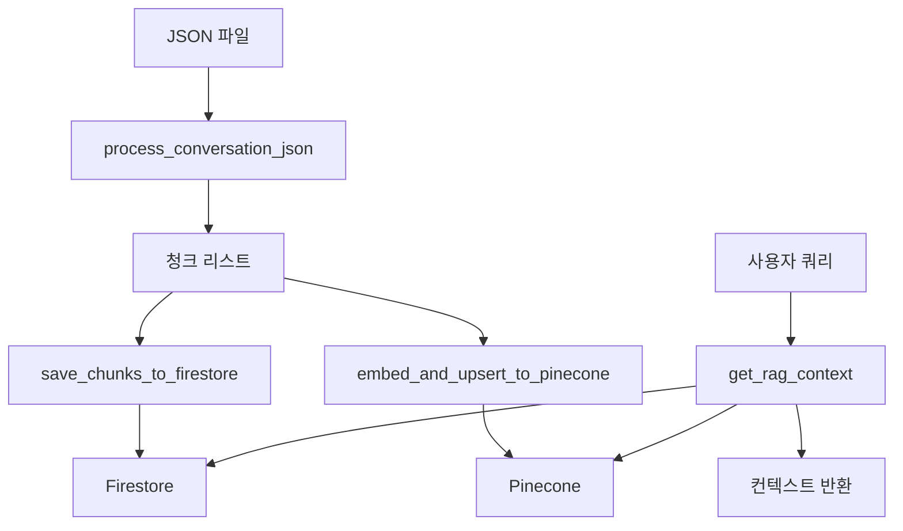

# 대화 RAG 시스템 (Conversation RAG Service)

## 📋 개요

이 서비스는 ChatGPT 대화 내역을 청크 단위로 처리하고, Firestore에 저장한 후 Pinecone에 임베딩하여 RAG(Retrieval-Augmented Generation) 검색을 수행하는 시스템입니다.

## 🏗️ 아키텍처



## 🔧 주요 함수

### 1. `process_conversation_json(user_id, document_id)`

Firebase Storage에서 JSON 파일을 다운로드하여 대화 내역을 청크 단위로 처리합니다.

**입력:**

- `user_id`: 사용자 ID
- `document_id`: 문서 ID (JSON 파일 ID)

**출력:**

- 청크 딕셔너리들의 리스트

**청크 구조:**

```python
{
    'chunk_id': 'document_id-0',          # 고유 ID
    'role': 'user',                       # 'user' 또는 'assistant'
    'text': '실제 발화 내용',              # 발화 텍스트
    'document_id': 'document_id',         # 문서 ID
    'conversation_id': 'conv_id',         # 대화 ID
    'conversation_title': '대화 제목',     # 대화 제목
    'timestamp': '2024-01-01T00:00:00',   # 타임스탬프
    'chunk_index': 0                      # 청크 인덱스
}
```

### 2. `embed_and_upsert_to_pinecone(chunks, user_id)`

User 발화만 임베딩하여 Pinecone에 업로드합니다.
User 발화의 메타데이터에 User 질문 이전의 Assistant 답변도 함께 저장합니다.

**입력:**

- `chunks`: 청크 리스트
- `user_id`: 사용자 ID (namespace로 사용)

**출력:**

- 업로드 성공 여부 (bool)

**특징:**

- User 발화만 필터링하여 임베딩
- User 발화 메타데이터에 User 질문 이전의 Assistant 답변 포함
- Cohere API 사용 (embed-multilingual-v3.0)
- Pinecone에 사용자별 namespace로 저장
- 100개씩 배치로 나누어 업로드 (4MB 제한 대응)
- 사용자 데이터 완전 격리

### 3. `get_rag_context(query, user_id, top_k=5)`

RAG 검색을 통해 관련 컨텍스트를 조회합니다.

**입력:**

- `query`: 사용자 질문
- `user_id`: 사용자 ID
- `top_k`: 검색할 유사한 발화 개수 (기본값: 5)

**출력:**

- 조합된 컨텍스트 문자열 (답변 → 질문 순서)

**검색 과정:**

1. 쿼리를 임베딩으로 변환
2. Pinecone에서 유사한 User 발화 검색 (top_k개)
3. Pinecone 메타데이터에서 User 발화와 User 질문 이전의 Assistant 답변 조회
4. 여러 대화의 Assistant 답변 + User 발화 조합 (답변 → 질문 순서)

## 🚀 사용법

### 기본 사용법

```python
import asyncio
from core.services.conversation_rag_service import (
    process_conversation_json,
    embed_and_upsert_to_pinecone,
    get_rag_context
)

async def main():
    # 설정
    user_id = "user_001"
    document_id = "document_001"  # Firebase Storage의 JSON 파일 ID

    # 1단계: Firebase Storage에서 JSON 파일 다운로드 및 처리
    chunks = process_conversation_json(user_id, document_id)

    # 2단계: Pinecone 업로드
    await embed_and_upsert_to_pinecone(chunks, user_id)

    # 3단계: RAG 검색
    context = await get_rag_context("해커톤이 무엇인가요?", user_id)
    print(context)

# 실행
asyncio.run(main())
```

### 클래스 기반 사용법

```python
from core.services.conversation_rag_service import ConversationRAGService

async def main():
    service = ConversationRAGService()
    user_id = "user_001"
    document_id = "document_001"  # Firebase Storage의 JSON 파일 ID

    # Firebase Storage에서 JSON 파일 다운로드 및 처리
    chunks = service.process_conversation_json(user_id, document_id)

    # Pinecone 업로드
    await service.embed_and_upsert_to_pinecone(chunks, user_id)

    # RAG 검색
    context = await service.get_rag_context("해커톤이 무엇인가요?", user_id)
    print(context)
```

## 🧪 테스트

### 테스트 스크립트 실행

````bash
# 전체 파이프라인 테스트
uv run python job_cheat/scripts/test_conversation_rag.py


## 📊 데이터 흐름

### 전체 파이프라인 흐름

1. **JSON 파일 업로드** → Firebase Storage (`users/{user_id}/json/{document_id}.json`)
2. **청크 생성** → `process_conversation_json()` 함수로 대화를 청크 단위로 분할
3. **Pinecone 업로드** → User 발화만 임베딩하여 user_id namespace에 저장 (User 질문 이전의 Assistant 답변은 메타데이터에 포함)
4. **RAG 검색** → 쿼리 임베딩 후 해당 사용자의 namespace에서 유사한 User 발화 검색
5. **컨텍스트 조합** → Pinecone 메타데이터에서 User 발화와 User 질문 이전의 Assistant 답변을 조합


## 📊 데이터 흐름

### 1. Firebase Storage JSON 파일 구조

**Storage 경로:** `users/{user_id}/json/{document_id}.json`

```json
{
  "conversations": [
    {
      "title": "대화 제목",
      "conversation_id": "conv_id",
      "messages": [
        {
          "role": "user",
          "content": "사용자 발화"
        },
        {
          "role": "assistant",
          "content": "어시스턴트 답변"
        }
      ]
    }
  ]
}
````

### 2. Pinecone 저장 구조

**Namespace:** `{user_id}` (사용자별 격리)

```
벡터 ID: document_001-0
벡터 값: [0.1, 0.2, ...] (1024차원)
Namespace: user_001
메타데이터:
  - text: "사용자 발화"
  - assistant_text: "어시스턴트 답변"  # Assistant 답변 포함
  - document_id: "document_001"
  - conversation_id: "conv_id"
  - conversation_title: "대화 제목"
  - role: "user"
  - timestamp: "2024-01-01T00:00:00"
```

## ⚙️ 환경 설정

### 필수 환경 변수

```env
# Cohere API
COHERE_API_KEY=your_cohere_api_key
COHERE_EMBED_MODEL=embed-multilingual-v3.0

# Pinecone API
PINECONE_API_KEY=your_pinecone_api_key
PINECONE_INDEX_NAME=job-cheat-vectors
PINECONE_INDEX_DIMENSION=1024

# Firebase
GOOGLE_APPLICATION_CREDENTIALS=path/to/firebase-credentials.json
```

### 의존성

```toml
[project]
dependencies = [
    "cohere>=5.0.0",
    "pinecone-client>=4.0.0",
    "firebase-admin",
    "google-cloud-firestore",
]
```

## 🔍 RAG 검색 예시

### 입력 쿼리

```
"해커톤이 무엇인가요?"
```

### 검색 과정

1. 쿼리 임베딩 생성
2. Pinecone에서 유사한 User 발화 검색
3. Firestore에서 관련 컨텍스트 조회

### 출력 컨텍스트 (답변 → 질문 순서)

```
어시스턴트: 해커톤은 **해킹(Hack) + 마라톤(Marathon)**의 합성어로, 정해진 시간 동안(보통 하루~일주일) 사람들이 모여 아이디어를 내고, 팀을 꾸려서, 실제로 동작하는 **프로토타입(시제품)이나 서비스**를 만들어내는 행사예요...

사용자: 해커톤이 뭔지 간단하게 설명해줘
```

## 🚨 주의사항

1. **비동기 함수**: `embed_and_upsert_to_pinecone`과 `get_rag_context`는 비동기 함수입니다.
2. **문서 격리**: 각 문서의 데이터는 `document_id`로 구분됩니다.
3. **Firebase Storage**: JSON 파일은 Firebase Storage의 `users/{user_id}/json/{document_id}.json` 경로에서 다운로드됩니다.
4. **User 발화만 임베딩**: Pinecone에는 User 발화만 저장되며, User 질문 이전의 Assistant 답변은 Pinecone 메타데이터에 포함됩니다.
5. **사용자별 격리**: Pinecone에서 user_id를 namespace로 사용하여 사용자별로 데이터를 완전히 격리합니다.
6. **Pinecone 배치 제한**: 벡터 업로드 시 100개씩 배치로 나누어 4MB 제한을 준수합니다.
7. **컨텍스트 순서**: RAG 검색 결과는 답변 → 질문 순서로 반환됩니다.

## 🔧 확장 가능성

- **청크 크기 조정**: 긴 텍스트를 여러 청크로 분할
- **메타데이터 확장**: 추가적인 메타데이터 필드 지원
- **필터링 기능**: 특정 조건으로 검색 결과 필터링
- **캐싱**: 자주 사용되는 임베딩 결과 캐싱
