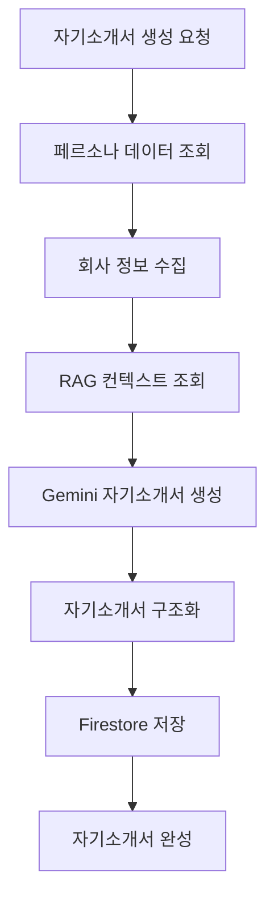

# Cover Letters App

AI 기반 자기소개서 생성 서비스를 제공하는 Django 앱입니다.

## 📋 개요

Cover Letters 앱은 사용자의 페르소나 데이터를 기반으로 회사별 맞춤형 자기소개서를 자동 생성하는 서비스입니다. RAG 시스템을 통해 사용자의 대화 내역을 활용하여 개인화된 자기소개서를 작성합니다.

## 🏗️ 구조

```
cover_letters/
├── services/              # 비즈니스 로직
│   └── cover_letter_service.py
├── apps.py               # 앱 설정
├── serializers.py        # DRF 시리얼라이저
├── urls.py              # URL 라우팅
└── views.py             # 뷰 로직
```

## 🚀 주요 기능

### 1. 자기소개서 생성

- 페르소나 데이터 기반 자기소개서 생성
- 회사별 맞춤형 자기소개서 작성
- RAG 시스템을 통한 개인화된 내용 생성

### 2. 자기소개서 관리

- 사용자별 자기소개서 목록 조회
- 자기소개서 상세 정보 조회
- 자기소개서 수정 및 삭제

### 3. 자기소개서 템플릿

- 다양한 자기소개서 스타일 지원
- 회사별 맞춤형 템플릿 적용
- 사용자 선호도 기반 스타일 선택

## 🔧 API 엔드포인트

### 자기소개서 목록 조회

```http
GET /api/cover-letters/
```

### 자기소개서 생성

```http
POST /api/cover-letters/generate/
{
    "persona_id": "persona123",
    "company_name": "카카오",
    "position": "백엔드 개발자",
    "style": "formal"
}
```

### 자기소개서 상세 조회

```http
GET /api/cover-letters/{cover_letter_id}/
```

### 자기소개서 수정

```http
PUT /api/cover-letters/{cover_letter_id}/
{
    "company_name": "네이버",
    "position": "프론트엔드 개발자",
    "style": "casual"
}
```

### 자기소개서 삭제

```http
DELETE /api/cover-letters/{cover_letter_id}/
```

## 🛠️ 사용법

### 자기소개서 서비스 사용

```python
from cover_letters.services.cover_letter_service import CoverLetterService

# 자기소개서 서비스 인스턴스 생성
cover_letter_service = CoverLetterService()

# 자기소개서 생성
cover_letter = await cover_letter_service.generate_cover_letter(
    user_id="user123",
    persona_id="persona456",
    company_name="카카오",
    position="백엔드 개발자",
    style="formal"
)

# 자기소개서 목록 조회
cover_letters = await cover_letter_service.get_cover_letters(
    user_id="user123",
    persona_id="persona456"
)
```

### 편의 함수 사용

```python
from cover_letters.services.cover_letter_service import (
    generate_cover_letter,
    get_cover_letters,
    get_cover_letter_detail
)

# 자기소개서 생성
cover_letter = await generate_cover_letter(
    user_id="user123",
    persona_id="persona456",
    company_name="카카오",
    position="백엔드 개발자"
)

# 자기소개서 상세 조회
detail = await get_cover_letter_detail(
    user_id="user123",
    persona_id="persona456",
    cover_letter_id="cover_letter789"
)
```

## 📊 데이터 흐름



## 🔧 환경 설정

### 필수 환경 변수

```env
# Firebase
FIREBASE_CREDENTIALS=path/to/firebase-credentials.json

# AI Services
GEMINI_API_KEY=your_gemini_api_key
COHERE_API_KEY=your_cohere_api_key
```

## 📚 관련 서비스

- **Core Services**: `gemini_service.py`, `conversation_rag_service.py`
- **Personas**: 페르소나 데이터 조회
- **Firebase**: 자기소개서 데이터 저장
