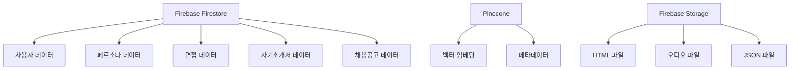
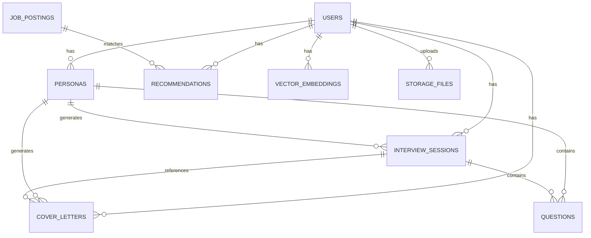

# 데이터베이스 스키마 설계

Job-Cheat 플랫폼의 데이터베이스 구조 및 스키마 설계 문서입니다.

## 📋 개요

Job-Cheat는 Firebase Firestore를 메인 데이터베이스로 사용하며, Pinecone을 벡터 데이터베이스로 활용합니다. 사용자별 데이터 격리와 RAG(Retrieval-Augmented Generation) 시스템을 위한 최적화된 스키마를 제공합니다.

## 🏗️ 아키텍처



## 🗄️ Firestore 컬렉션 구조

### 1. 사용자 컬렉션 (`users`)

#### 1.1 사용자 기본 정보

```json
{
  "uid": "string",
  "email": "string",
  "display_name": "string",
  "photo_url": "string",
  "email_verified": "boolean",
  "provider_id": "string",
  "created_at": "timestamp",
  "updated_at": "timestamp"
}
```

#### 1.2 페르소나 서브컬렉션 (`personas`)

```json
{
  "id": "string",
  "user_id": "string",
  "job_category": "string",
  "core_competencies": ["string"],
  "competencies": {
    "문제분해": {
      "score": "number",
      "strengths": ["string"],
      "improvements": ["string"],
      "citations": ["string"]
    }
  },
  "final_evaluation": "string",
  "created_at": "timestamp",
  "updated_at": "timestamp"
}
```

#### 1.3 면접 세션 서브컬렉션 (`interview_sessions`)

```json
{
  "id": "string",
  "user_id": "string",
  "persona_id": "string",
  "cover_letter_id": "string",
  "session_type": "string",
  "use_voice": "boolean",
  "status": "string",
  "total_questions": "number",
  "completed_questions": "number",
  "total_score": "number",
  "average_score": "number",
  "created_at": "timestamp",
  "updated_at": "timestamp",
  "completed_at": "timestamp"
}
```

#### 1.4 질문 서브컬렉션 (`questions`)

```json
{
  "id": "string",
  "user_id": "string",
  "persona_id": "string",
  "interview_session_id": "string",
  "question_text": "string",
  "question_type": "string",
  "audio_url": "string",
  "audio_size": "number",
  "answer_text": "string",
  "answer_audio_url": "string",
  "score": "number",
  "feedback": "string",
  "time_taken": "number",
  "created_at": "timestamp",
  "answered_at": "timestamp"
}
```

#### 1.5 자기소개서 서브컬렉션 (`cover_letters`)

```json
{
  "id": "string",
  "user_id": "string",
  "persona_id": "string",
  "company_name": "string",
  "position": "string",
  "style": "string",
  "content": "string",
  "character_count": "number",
  "created_at": "timestamp",
  "updated_at": "timestamp"
}
```

### 2. 벡터 임베딩 컬렉션 (`user_vector_embeddings`)

```json
{
  "embeddings": [
    {
      "chunk_id": "string",
      "text": "string",
      "metadata": {
        "role": "string",
        "document_id": "string",
        "conversation_id": "string",
        "conversation_title": "string",
        "timestamp": "string",
        "chunk_index": "number",
        "assistant_text": "string"
      }
    }
  ],
  "metadata": {
    "total_conversations": "number",
    "last_updated": "timestamp",
    "embedding_model": "string",
    "created_at": "timestamp"
  }
}
```

### 3. 채용공고 컬렉션 (`job_postings`)

```json
{
  "id": "string",
  "title": "string",
  "company": "string",
  "location": "string",
  "job_type": "string",
  "experience_level": "string",
  "description": "string",
  "requirements": ["string"],
  "benefits": ["string"],
  "salary_range": "string",
  "posted_date": "timestamp",
  "expiry_date": "timestamp",
  "source": "string",
  "url": "string",
  "created_at": "timestamp",
  "updated_at": "timestamp"
}
```

### 4. 추천 결과 컬렉션 (`recommendations`)

```json
{
  "id": "string",
  "user_id": "string",
  "persona_id": "string",
  "job_posting_id": "string",
  "match_score": "number",
  "match_reasons": ["string"],
  "competency_matches": {
    "문제분해": {
      "score": "number",
      "match_percentage": "number"
    }
  },
  "created_at": "timestamp"
}
```

## 🗂️ Firebase Storage 구조

### 파일 저장 경로

```
users/
├── {user_id}/
│   ├── html/
│   │   └── {document_id}.html
│   ├── json/
│   │   └── {document_id}.json
│   └── audio/
│       └── interviews/
│           └── {interview_session_id}/
│               └── {question_id}.mp3
```

### 파일 메타데이터

```json
{
  "path": "string",
  "content_type": "string",
  "size": "number",
  "url": "string",
  "created_at": "timestamp"
}
```

## 🔍 Pinecone 벡터 데이터베이스

### 네임스페이스 구조

- **사용자별 격리**: `{user_id}` 네임스페이스로 사용자별 데이터 완전 격리
- **벡터 차원**: 1024차원 (Cohere 임베딩 모델)
- **메타데이터**: Firestore와 동기화된 메타데이터 저장

### 벡터 저장 구조

```json
{
  "id": "document_001-0",
  "values": [0.1, 0.2, ...], // 1024차원 벡터
  "metadata": {
    "text": "사용자 발화 내용",
    "role": "user",
    "document_id": "document_001",
    "conversation_id": "conv_001",
    "conversation_title": "대화 제목",
    "timestamp": "2024-01-01T00:00:00",
    "chunk_index": 0,
    "assistant_text": "이전 어시스턴트 답변"
  }
}
```

## 📊 데이터 관계도



## 🔧 인덱싱 전략

### Firestore 인덱스

1. **사용자별 페르소나 조회**

   - `users/{user_id}/personas` (자동 인덱스)

2. **면접 세션 조회**

   - `users/{user_id}/personas/{persona_id}/interview_sessions` (자동 인덱스)

3. **질문 조회**

   - `users/{user_id}/personas/{persona_id}/interview_sessions/{session_id}/questions` (자동 인덱스)

4. **자기소개서 조회**
   - `users/{user_id}/personas/{persona_id}/cover_letters` (자동 인덱스)

### Pinecone 인덱스

1. **사용자별 벡터 검색**

   - 네임스페이스: `{user_id}`
   - 필터: `role = "user"`

2. **메타데이터 필터링**
   - `document_id`, `conversation_id`, `timestamp` 등

## 📚 참고 자료

- [Firebase Firestore 문서](https://firebase.google.com/docs/firestore)
- [Pinecone 문서](https://docs.pinecone.io/)
- [Firebase Storage 문서](https://firebase.google.com/docs/storage)
- [RAG 시스템 구현 가이드](../core/services/README_Conversation_RAG_System.md)
