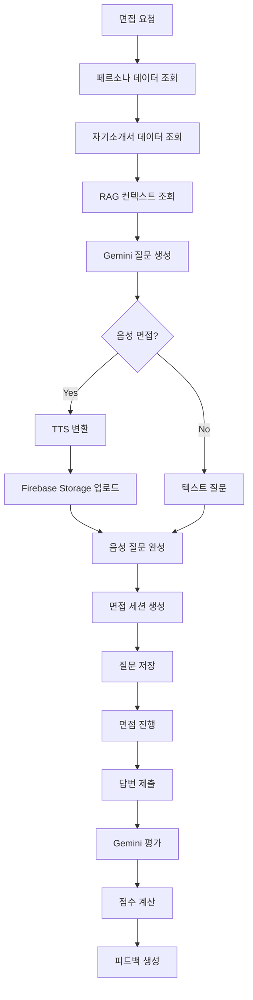

# Interviews App

AI 기반 면접 서비스를 제공하는 Django 앱입니다.

## 📋 개요

Interviews 앱은 사용자의 페르소나 데이터를 기반으로 맞춤형 면접 질문을 생성하고, 음성 면접을 지원하며, 실시간 답변 평가 및 피드백을 제공하는 종합적인 면접 서비스입니다.

## 🏗️ 구조

```
interviews/
├── services/              # 비즈니스 로직
│   └── interview_service.py
├── database/              # 정적 데이터
│   ├── interview.json
│   └── question.json
├── apps.py               # 앱 설정
├── serializers.py        # DRF 시리얼라이저
├── urls.py              # URL 라우팅
└── views.py             # 뷰 로직
```

## 🚀 주요 기능

### 1. 면접 준비 데이터 조회

- 페르소나 카드 생성
- 자기소개서 목록 조회
- 면접 준비에 필요한 모든 데이터 통합

### 2. 면접 질문 생성

- AI 기반 맞춤형 질문 생성 (Gemini)
- 페르소나, 자기소개서, 대화 내역 기반
- 일반 면접 및 음성 면접 지원

### 3. 음성 면접 지원

- TTS를 통한 질문 음성 변환
- Firebase Storage에 오디오 파일 저장
- 음성 질문 재생 지원

### 4. 답변 평가 및 피드백

- AI 기반 답변 평가 (Gemini)
- 실시간 점수 계산
- 개선점 및 모범 답변 제공

### 5. 면접 세션 관리

- 면접 세션 생성 및 관리
- 질문별 답변 저장
- 면접 결과 통계 및 분석

## 🔧 API 엔드포인트

### 면접 준비 데이터 조회

```http
GET /api/interviews/preparation/
```

### 면접 질문 생성

```http
POST /api/interviews/generate/
{
    "persona_id": "persona123",
    "cover_letter_id": "cover_letter456",
    "use_voice": true
}
```

### 다음 질문 조회

```http
GET /api/interviews/next-question/
```

### 답변 제출 (텍스트)

```http
POST /api/interviews/submit-answer/
{
    "interview_session_id": "session789",
    "question_id": "question101",
    "answer_text": "답변 내용",
    "time_taken": 120
}
```

### 답변 제출 (음성)

```http
POST /api/interviews/submit-voice-answer/
Content-Type: multipart/form-data

{
    "interview_session_id": "session789",
    "question_id": "question101",
    "audio_file": <file>,
    "time_taken": 120
}
```

### 면접 결과 조회

```http
GET /api/interviews/result/{interview_session_id}/
```

## 🛠️ 사용법

### 면접 서비스 사용

```python
from interviews.services.interview_service import InterviewService

# 면접 서비스 인스턴스 생성
interview_service = InterviewService()

# 면접 질문 생성
result = await interview_service.generate_interview_questions(
    user_id="user123",
    persona_id="persona456",
    cover_letter_id="cover_letter789",
    use_voice=True
)

# 답변 제출
await interview_service.submit_answer_async(
    user_id="user123",
    persona_id="persona456",
    interview_session_id="session101",
    question_id="question202",
    answer_text="답변 내용",
    time_taken=120
)
```

### 편의 함수 사용

```python
from interviews.services.interview_service import (
    generate_interview_questions,
    submit_answer_async,
    get_interview_record
)

# 면접 질문 생성
questions = await generate_interview_questions(
    user_id="user123",
    persona_id="persona456",
    use_voice=True
)

# 면접 기록 조회
record = await get_interview_record(
    user_id="user123",
    persona_id="persona456"
)
```

## 📊 데이터 흐름



## 🔧 환경 설정

### 필수 환경 변수

```env
# Firebase
FIREBASE_CREDENTIALS=path/to/firebase-credentials.json

# AI Services
GEMINI_API_KEY=your_gemini_api_key
COHERE_API_KEY=your_cohere_api_key

# TTS/STT
GOOGLE_APPLICATION_CREDENTIALS=path/to/firebase-credentials.json
```

## 📚 관련 서비스

- **Core Services**: `gemini_service.py`, `tts_service.py`, `whisper_service.py`
- **Personas**: 페르소나 데이터 조회
- **Cover Letters**: 자기소개서 데이터 조회
- **RAG System**: 대화 내역 검색
