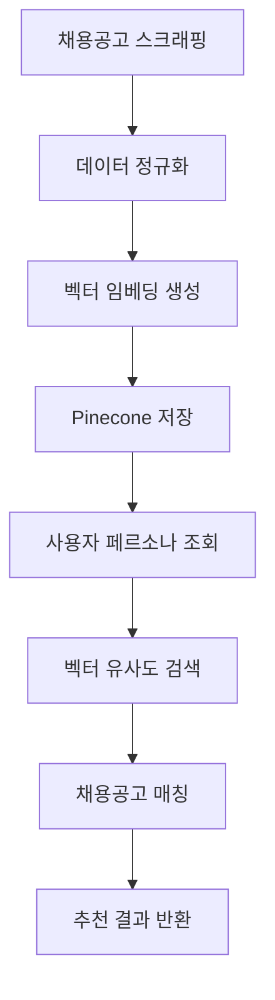

# Job Search App

채용공고 검색, 스크래핑, 추천 서비스를 제공하는 Django 앱입니다.

## 📋 개요

Job Search 앱은 다양한 채용 사이트에서 채용공고를 수집하고, 사용자의 페르소나 데이터를 기반으로 맞춤형 채용공고를 추천하는 서비스입니다. 벡터 유사도 검색을 통해 사용자에게 최적의 채용공고를 제공합니다.

## 🏗️ 구조

```
job_search/
├── services/              # 비즈니스 로직
│   ├── scrap_service.py   # 채용공고 스크래핑
│   ├── job_matching.py    # 채용공고 매칭
│   ├── job_posting.py     # 채용공고 데이터 관리
│   └── recommendation.py  # 추천 시스템
├── apps.py               # 앱 설정
├── serializers.py        # DRF 시리얼라이저
├── urls.py              # URL 라우팅
└── views.py             # 뷰 로직
```

## 🚀 주요 기능

### 1. 채용공고 스크래핑

- 다양한 채용 사이트에서 채용공고 수집
- 실시간 채용공고 업데이트
- 채용공고 데이터 정규화 및 저장

### 2. 채용공고 매칭

- 페르소나 데이터 기반 채용공고 매칭
- 벡터 유사도 검색을 통한 정확한 매칭
- 사용자 선호도 기반 필터링

### 3. 채용공고 추천

- AI 기반 개인화된 채용공고 추천
- 사용자 행동 패턴 분석
- 실시간 추천 시스템

### 4. 채용공고 관리

- 채용공고 데이터 CRUD
- 채용공고 통계 및 분석
- 채용공고 품질 관리

## 🔧 API 엔드포인트

### 채용공고 추천

```http
GET /api/job-search/recommendations/
{
    "user_id": "user123",
    "persona_id": "persona456",
    "limit": 10
}
```

### 채용공고 검색

```http
GET /api/job-search/search/
{
    "query": "백엔드 개발자",
    "location": "서울",
    "company": "카카오"
}
```

### 채용공고 상세 조회

```http
GET /api/job-search/jobs/{job_id}/
```

### 채용공고 스크래핑

```http
POST /api/job-search/scrape/
{
    "sources": ["saramin", "jobkorea"],
    "keywords": ["백엔드", "개발자"]
}
```

## 🛠️ 사용법

### 채용공고 서비스 사용

```python
from job_search.services.recommendation import get_recommendations
from job_search.services.job_matching import match_jobs
from job_search.services.scrap_service import scrape_jobs

# 채용공고 추천
recommendations = await get_recommendations(
    user_id="user123",
    persona_id="persona456",
    limit=10
)

# 채용공고 매칭
matched_jobs = await match_jobs(
    user_id="user123",
    persona_id="persona456",
    job_category="백엔드 개발자"
)

# 채용공고 스크래핑
scraped_jobs = await scrape_jobs(
    sources=["saramin", "jobkorea"],
    keywords=["백엔드", "개발자"]
)
```

### 편의 함수 사용

```python
from job_search.services import (
    get_recommendations,
    match_jobs,
    scrape_jobs
)

# 채용공고 추천
recommendations = await get_recommendations(
    user_id="user123",
    persona_id="persona456"
)

# 채용공고 매칭
matched_jobs = await match_jobs(
    user_id="user123",
    persona_id="persona456"
)
```

## 📊 데이터 흐름



## 🔧 환경 설정

### 필수 환경 변수

```env
# Firebase
FIREBASE_CREDENTIALS=path/to/firebase-credentials.json

# AI Services
GEMINI_API_KEY=your_gemini_api_key
COHERE_API_KEY=your_cohere_api_key
PINECONE_API_KEY=your_pinecone_api_key
```

## 📚 관련 서비스

- **Core Services**: `gemini_service.py`, `cohere_service.py`, `pinecone_service.py`
- **Personas**: 페르소나 데이터 조회
- **Firebase**: 채용공고 데이터 저장
