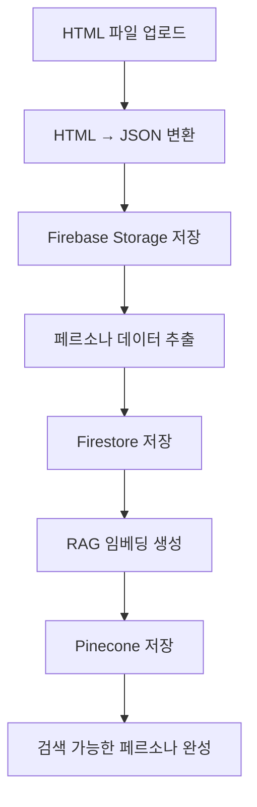

# Personas App

사용자의 페르소나 데이터를 관리하는 Django 앱입니다.

## 📋 개요

Personas 앱은 사용자가 업로드한 ChatGPT 대화 내역을 처리하여 페르소나 데이터를 추출하고 관리하는 기능을 제공합니다. RAG 시스템을 통해 대화 내역을 검색 가능한 형태로 저장합니다.

## 🏗️ 구조

```
personas/
├── api/                   # API 관련 파일들
│   └── serializers.py    # API 전용 시리얼라이저
├── tests/                # 테스트 파일들
│   ├── test_serializers.py
│   └── test_views.py
├── apps.py               # 앱 설정
├── serializers.py        # DRF 시리얼라이저
├── urls.py              # URL 라우팅
└── views.py             # 뷰 로직
```

## 🚀 주요 기능

### 1. 페르소나 데이터 업로드

- ChatGPT 대화 내역 HTML 파일 업로드
- 자동 HTML → JSON 변환
- Firebase Storage에 파일 저장

### 2. 페르소나 데이터 처리

- 대화 내역에서 페르소나 정보 추출
- RAG 시스템을 통한 임베딩 생성
- Pinecone 벡터 데이터베이스에 저장

### 3. 페르소나 데이터 조회

- 사용자별 페르소나 목록 조회
- 페르소나 상세 정보 조회
- RAG 기반 대화 내역 검색

## 🔧 API 엔드포인트

### 페르소나 입력 생성

```http
POST /api/personas/input/create/
Content-Type: multipart/form-data

{
    "html_file": <file>,
    "user_id": "user123"
}
```

### 페르소나 목록 조회

```http
GET /api/personas/list/
```

### 페르소나 상세 조회

```http
GET /api/personas/{persona_id}/
```

## 🛠️ 사용법

### 뷰에서 페르소나 서비스 사용

```python
from core.services.firebase_personas import get_persona_document
from core.services.conversation_rag_service import get_rag_context

# 페르소나 데이터 조회
persona = get_persona_document(
    user_id="user123",
    persona_id="persona456"
)

# RAG 검색
context = await get_rag_context(
    query="프로젝트 경험에 대해 말해주세요",
    user_id="user123",
    top_k=5
)
```

### 시리얼라이저 사용

```python
from personas.serializers import PersonaInputSerializer

# 페르소나 입력 데이터 검증
serializer = PersonaInputSerializer(data=request.data)
if serializer.is_valid():
    # 유효한 데이터 처리
    pass
```

## 📊 데이터 흐름



## 🔧 환경 설정

### 필수 환경 변수

```env
# Firebase
FIREBASE_CREDENTIALS=path/to/firebase-credentials.json

# AI Services
GEMINI_API_KEY=your_gemini_api_key
COHERE_API_KEY=your_cohere_api_key
PINECONE_API_KEY=your_pinecone_api_key
```

## 📚 관련 서비스

- **Core Services**: `firebase_personas.py`, `conversation_rag_service.py`
- **Firebase Storage**: 파일 업로드 및 저장
- **RAG System**: 대화 내역 임베딩 및 검색
